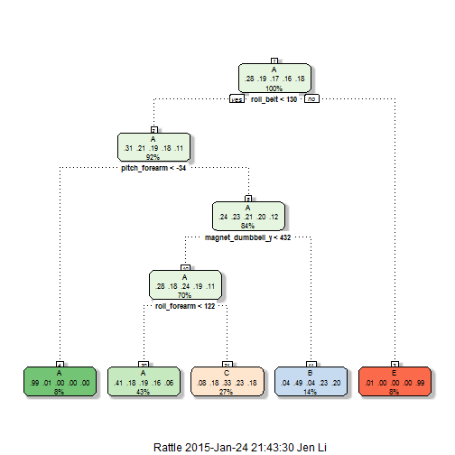
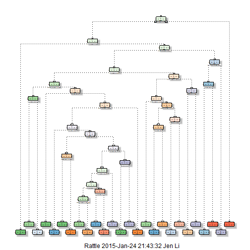

### Objective
In this write up, it presents to you the steps of developing a model to predict the biceps position spec (class A-E) the participants performed.  The traning data provide by Groupware@LES contains 160 variables (include ID and class) collected from six participants over 3 days in 2011.

Description of classes - Six young health participants were asked to perform one set of 10 repetitions of the Unilateral Dumbbell Biceps Curl in five different fashions: 

- Class A: exactly according to the specification, 
- Class B: throwing the elbows to the front, 
- Class C: lifting the dumbbell only halfway, 
- Class D: lowering the dumbbell only halfway and 
- Class E: throwing the hips to the front

##### sources:
More information can be found in http://groupware.les.inf.puc-rio.br/har


### Analysis

#### 0.Set Up R environment/Load Data
1. set up directory
2. Load required R packages/libraries
3. Load training/testing data from website


```r
setwd("~/GitHub/Practical Machine Learning")

library(graphics);library(caret);library(plyr)
library(rpart);library(rpart.plot)
library(randomForest);library(rattle);library(ggplot2)

# Read csv data file 

in_training = "https://d396qusza40orc.cloudfront.net/predmachlearn/pml-training.csv"
in_testing = "https://d396qusza40orc.cloudfront.net/predmachlearn/pml-testing.csv"
pml_training <- read.table("pml-training.csv", head = T, sep=",", na.string=c("NA","#DIV/0!")) 
pml_testing <- read.table("pml-testing.csv", head = T, sep=",", na.string=c("NA","#DIV/0!")) 
```
#### 1.Tidy dataset

The following steps performed to prepare the training dataset for building the model for prediction.  

- Convert blanks ("") and "#DIV/0!" to "NA" 
- Remove user_name, raw timestamps, windows cnt(7 variables)
- Remove variables with more than 70% missing value
- repeat the process on the testing dataset


```r
#review the training dataset 
head(pml_training$classe)

#Count training dataset variables for null values
train_nulls <- sapply(pml_training, function(x) sum(is.na(x)))
train_nulls

pml_training <- pml_training[,-(1:7)]
pml_testing <- pml_testing[,-(1:7)]

#prepare the list of variables to be removewd
#Training Data
var_train = list()
for (i in 1:ncol(pml_training)){
  if ((sum(is.na(pml_training[i]))/nrow(pml_training)) > .70) {
    var_train = append(var_train, colnames(pml_training[i]))
  }
}

#testing data
var_test = list()
for (i in 1:ncol(pml_testing)){
  if ((sum(is.na(pml_testing[i]))/nrow(pml_testing)) > .70) {
    var_test = append(var_test, colnames(pml_testing[i]))
  }
}
#remove columns with greater than 19000 from the training dataset 
pml_training = pml_training[,!colnames(pml_training) %in% var_train]
pml_testing = pml_testing[,!colnames(pml_testing) %in% var_test]

#check dataset for completeness
sum(complete.cases(pml_training) == TRUE)
sum(complete.cases(pml_testing) == TRUE)
```
After variables with greater than 70% missing value, the training data set retain 53variables and testing dataset retain 53 variables


```r
inTrain = createDataPartition(y=pml_training$classe, p=0.70, list=FALSE)
myTrain = pml_training[inTrain,]; myTest = pml_training[-inTrain,]
dim(myTrain); dim(myTest)
```

```
## [1] 13737    53
```

```
## [1] 5885   53
```
70%-30% partition training dataset into training (13737obs) and testing(`r nrow(myTest)' obs)

#### 2. Modeling and Choosing variables

```r
set.seed(18688)

modelrpart <- train(classe ~ ., data=myTrain, method='rpart')
fancyRpartPlot(modelrpart$finalModel)
```

 

```r
# Decision Tree package -- more nodes and trees
modelTree <- rpart(classe ~., data=myTrain, method='class')
#print(modelTree)
fancyRpartPlot(modelTree)
```

 

```r
#Random Forest Model

modelRF <- randomForest(classe ~., data=myTrain)
print(modelRF)
```

```
## 
## Call:
##  randomForest(formula = classe ~ ., data = myTrain) 
##                Type of random forest: classification
##                      Number of trees: 500
## No. of variables tried at each split: 7
## 
##         OOB estimate of  error rate: 0.52%
## Confusion matrix:
##      A    B    C    D    E  class.error
## A 3904    1    0    0    1 0.0005120328
## B   13 2640    5    0    0 0.0067720090
## C    0   10 2384    2    0 0.0050083472
## D    0    0   28 2222    2 0.0133214920
## E    0    0    1    8 2516 0.0035643564
```

```
#### 3. Cross Validation models 

In applying the best of the two working models - Classification Tree and Random Forest, in predicting in sample error, the confusion matrix returned a higher rate of accuracy for Random Forest predictions.


```r
predict_tree = predict(modelTree, newdata=myTest, type='class')
confusionMatrix(predict_tree, myTest$classe)
```

```
## Confusion Matrix and Statistics
## 
##           Reference
## Prediction    A    B    C    D    E
##          A 1523  175   22   53   13
##          B   66  722  134   99   96
##          C   34  119  748   95   77
##          D   33   68   83  629   81
##          E   18   55   39   88  815
## 
## Overall Statistics
##                                           
##                Accuracy : 0.754           
##                  95% CI : (0.7427, 0.7649)
##     No Information Rate : 0.2845          
##     P-Value [Acc > NIR] : < 2.2e-16       
##                                           
##                   Kappa : 0.688           
##  Mcnemar's Test P-Value : 9.91e-15        
## 
## Statistics by Class:
## 
##                      Class: A Class: B Class: C Class: D Class: E
## Sensitivity            0.9098   0.6339   0.7290   0.6525   0.7532
## Specificity            0.9375   0.9168   0.9331   0.9461   0.9584
## Pos Pred Value         0.8527   0.6464   0.6971   0.7036   0.8030
## Neg Pred Value         0.9632   0.9125   0.9422   0.9329   0.9452
## Prevalence             0.2845   0.1935   0.1743   0.1638   0.1839
## Detection Rate         0.2588   0.1227   0.1271   0.1069   0.1385
## Detection Prevalence   0.3035   0.1898   0.1823   0.1519   0.1725
## Balanced Accuracy      0.9237   0.7753   0.8311   0.7993   0.8558
```

```r
predict_RF= predict(modelRF, newdata=myTest, type='class')
confusionMatrix(predict_RF, myTest$classe)
```

```
## Confusion Matrix and Statistics
## 
##           Reference
## Prediction    A    B    C    D    E
##          A 1674    3    0    0    0
##          B    0 1131    6    0    0
##          C    0    5 1019    7    1
##          D    0    0    1  957    3
##          E    0    0    0    0 1078
## 
## Overall Statistics
##                                           
##                Accuracy : 0.9956          
##                  95% CI : (0.9935, 0.9971)
##     No Information Rate : 0.2845          
##     P-Value [Acc > NIR] : < 2.2e-16       
##                                           
##                   Kappa : 0.9944          
##  Mcnemar's Test P-Value : NA              
## 
## Statistics by Class:
## 
##                      Class: A Class: B Class: C Class: D Class: E
## Sensitivity            1.0000   0.9930   0.9932   0.9927   0.9963
## Specificity            0.9993   0.9987   0.9973   0.9992   1.0000
## Pos Pred Value         0.9982   0.9947   0.9874   0.9958   1.0000
## Neg Pred Value         1.0000   0.9983   0.9986   0.9986   0.9992
## Prevalence             0.2845   0.1935   0.1743   0.1638   0.1839
## Detection Rate         0.2845   0.1922   0.1732   0.1626   0.1832
## Detection Prevalence   0.2850   0.1932   0.1754   0.1633   0.1832
## Balanced Accuracy      0.9996   0.9959   0.9953   0.9960   0.9982
```
#### 4. Random Forest Model for Predition final 
Random Forest Model choose to be the final model


```r
pred_testing = predict(modelRF, pml_testing, type='class')
print(pred_testing)
```

```
##  1  2  3  4  5  6  7  8  9 10 11 12 13 14 15 16 17 18 19 20 
##  B  A  B  A  A  E  D  B  A  A  B  C  B  A  E  E  A  B  B  B 
## Levels: A B C D E
```

#### 5. Submission Function: generate testing case in result files for submission


```r
pml_write_files = function(x){
  n = length(x)
  for(i in 1:n){
    filename = paste0("./predictions/problem_id_", i, ".txt")
    write.table(x[i],file=filename,quote=FALSE,row.names=FALSE,col.names=FALSE)
  }
}
pml_write_files(pred_testing)
```

